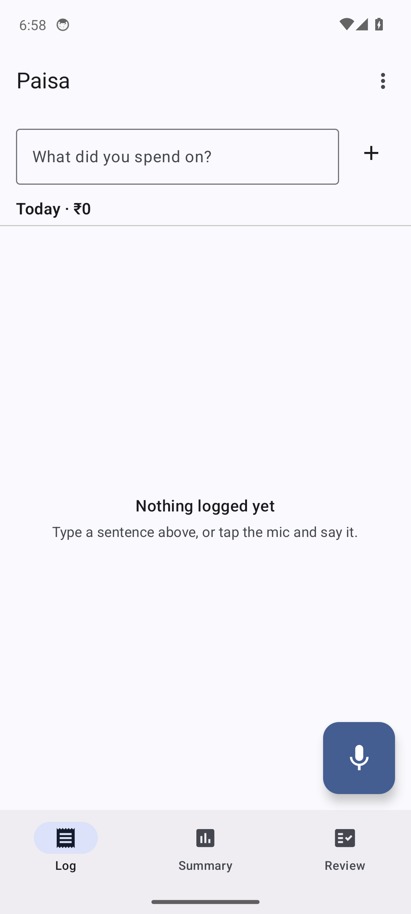
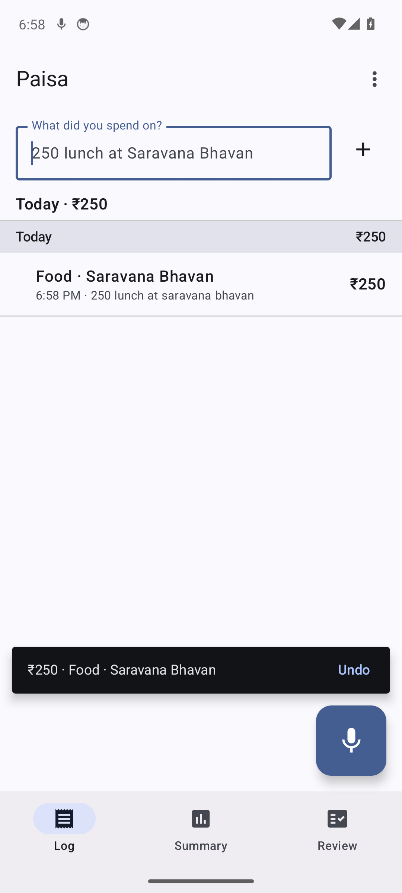
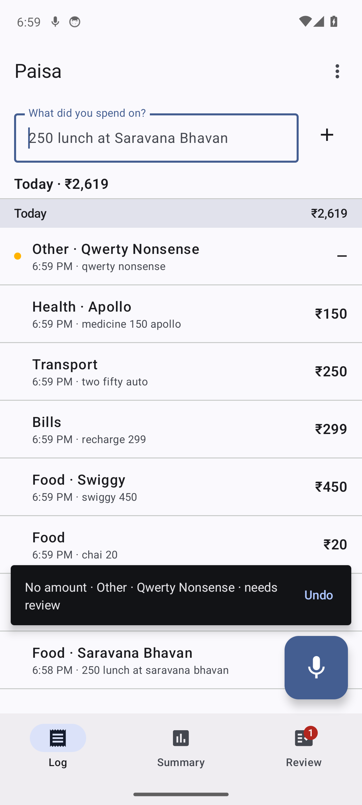
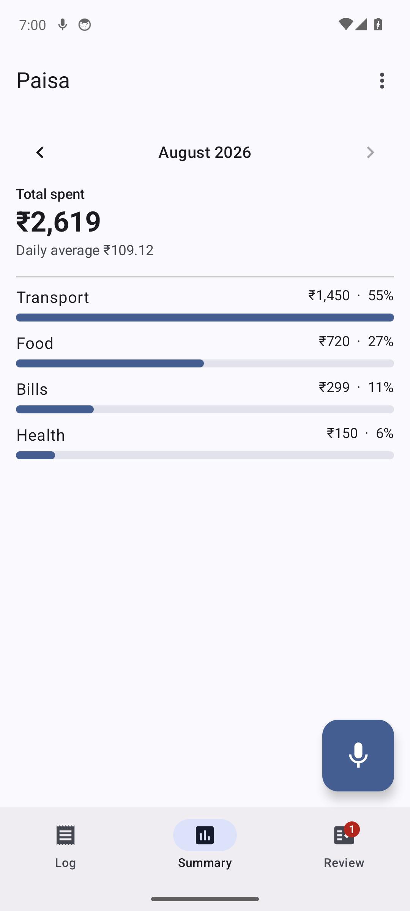
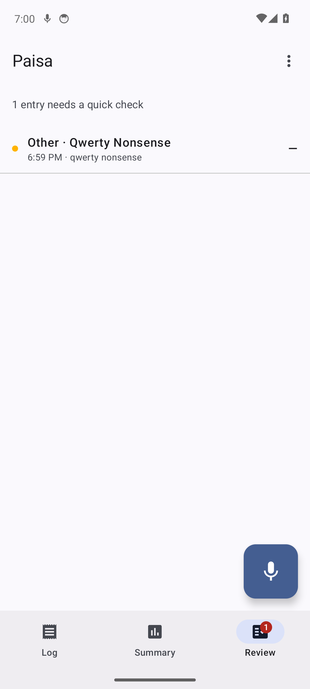
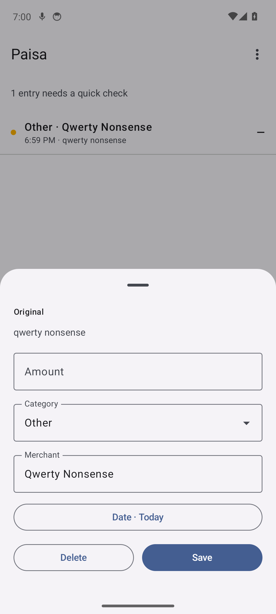
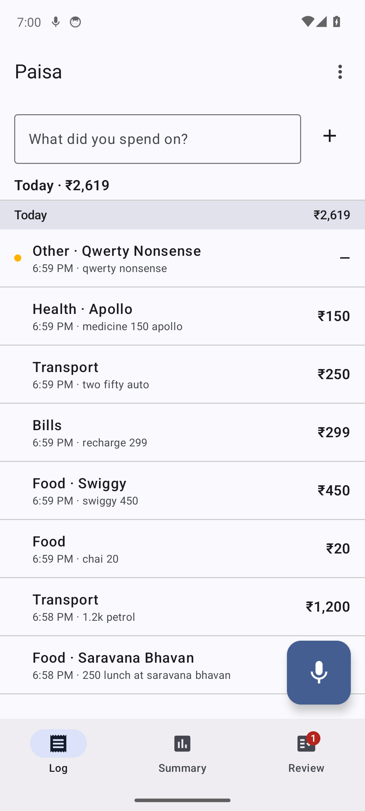
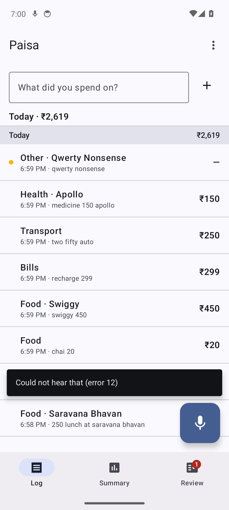

# Emulator run

Pixel 6 profile, API 34, x86_64. The app is installed from the debug
APK and driven through adb; taps resolve through the accessibility
tree rather than fixed coordinates.

- Scripted walkthrough: **ok**
- Instrumented UI tests: **pass**

## Screens

### Fresh install — empty state, text entry, mic button



### Typed a sentence, parsed and saved with an Undo snackbar



### A day of expenses; the unparsed one flagged amber



### Monthly total, category bars, daily average



### Review queue — entries the parser wasn't sure about



### Edit sheet — original sentence kept, everything correctable



### Back on the log tab



### Mic tapped — recogniser state and error handling



## Instrumented test output

```
> Task :app:checkDebugDuplicateClasses UP-TO-DATE
> Task :app:mergeExtDexDebug UP-TO-DATE
> Task :app:mergeLibDexDebug UP-TO-DATE
> Task :app:mergeProjectDexDebug UP-TO-DATE
> Task :app:mergeDebugJniLibFolders UP-TO-DATE
> Task :app:mergeDebugNativeLibs UP-TO-DATE
> Task :app:stripDebugDebugSymbols UP-TO-DATE
> Task :app:validateSigningDebug UP-TO-DATE
> Task :app:writeDebugAppMetadata UP-TO-DATE
> Task :app:writeDebugSigningConfigVersions UP-TO-DATE
> Task :app:packageDebug UP-TO-DATE
> Task :app:createDebugApkListingFileRedirect UP-TO-DATE
> Task :app:mergeDebugAndroidTestShaders
> Task :app:compileDebugAndroidTestShaders NO-SOURCE
> Task :app:copyRoomSchemasToAndroidTestAssetsDebugAndroidTest
> Task :app:generateDebugAndroidTestAssets UP-TO-DATE
> Task :app:mergeDebugAndroidTestAssets
> Task :app:compressDebugAndroidTestAssets FROM-CACHE
> Task :app:desugarDebugAndroidTestFileDependencies FROM-CACHE
> Task :app:dexBuilderDebugAndroidTest FROM-CACHE
> Task :app:mergeDebugAndroidTestGlobalSynthetics FROM-CACHE
> Task :app:processDebugAndroidTestJavaRes
> Task :app:mergeDebugAndroidTestJniLibFolders
> Task :app:checkDebugAndroidTestDuplicateClasses
> Task :app:mergeExtDexDebugAndroidTest FROM-CACHE
> Task :app:mergeLibDexDebugAndroidTest FROM-CACHE
> Task :app:mergeProjectDexDebugAndroidTest FROM-CACHE
> Task :app:mergeDebugAndroidTestJavaResource
> Task :app:mergeDebugAndroidTestNativeLibs NO-SOURCE
> Task :app:stripDebugAndroidTestDebugSymbols NO-SOURCE
> Task :app:validateSigningDebugAndroidTest
> Task :app:writeDebugAndroidTestSigningConfigVersions
> Task :app:packageDebugAndroidTest
> Task :app:createDebugAndroidTestApkListingFileRedirect
[EmulatorConsole]: Failed to start Emulator console for 5554

> Task :app:connectedDebugAndroidTest
Starting 4 tests on emulator-5554 - 14

emulator-5554 - 14 Tests 3/4 completed. (0 skipped) (0 failed)
Finished 4 tests on emulator-5554 - 14
gradle/actions: Writing build results to /home/runner/work/_temp/.gradle-actions/build-results/__reactivecircus_android-emulator-runner-1787598024146.json

BUILD SUCCESSFUL in 28s
66 actionable tasks: 16 executed, 15 from cache, 35 up-to-date
```

