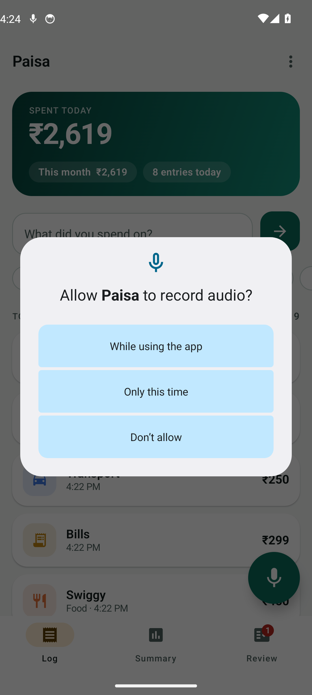
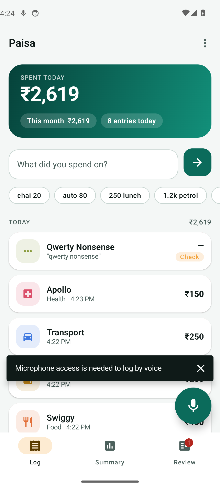

# Emulator run

Pixel 6 profile, API 34, x86_64. The app is installed from the debug
APK and driven through adb; taps resolve through the accessibility
tree rather than fixed coordinates.

- Scripted walkthrough: **ok**
- Instrumented UI, load and performance tests: **pass**
- Release APK installs: **yes**
- Smoke pass on the release build: **pass** (see docs/qa-report.md)

## Screens

### Fresh install — empty state, text entry, mic button


### Typed a sentence, parsed and saved with an Undo snackbar


### A day of expenses; the unparsed one flagged amber


### Monthly total, category bars, daily average


### Review queue — entries the parser wasn't sure about


### Edit sheet — original sentence kept, everything correctable


### Back on the log tab


### Mic tapped — recogniser state and fallback


### Mic without permission — the system prompt



### Permission denied — the app explains why the mic is needed



## What the recogniser reported

```
--------- beginning of main
08-27 16:23:40.077  3335  3335 W PaisaVoice: error 12 on ON_DEVICE (attempt 1)
08-27 16:23:40.078  3335  3335 D PaisaVoice: ready for speech on ON_DEVICE
08-27 16:23:40.444  3335  3335 D PaisaVoice: ready for speech on SYSTEM_SERVICE
08-27 16:23:41.733  3335  3335 D PaisaVoice: beginning of speech
08-27 16:23:43.290  3335  3335 D PaisaVoice: end of speech
08-27 16:23:43.359  3335  3335 D PaisaVoice: beginning of speech
08-27 16:23:43.390  3335  3335 W PaisaVoice: error 7 on SYSTEM_SERVICE (attempt 2)
```

## Load and performance measurements

```
--------- beginning of main
08-27 16:24:29.497  7298  7318 I PaisaPerf: bulk_insert_ms_for_10000=4578
08-27 16:24:29.604  7298  7318 I PaisaPerf: single_insert_ms_for_50=107
08-27 16:24:29.761  7298  7318 I PaisaPerf: observe_all_first_emission_ms=157
08-27 16:24:29.765  7298  7318 I PaisaPerf: category_aggregation_ms=4
08-27 16:24:29.766  7298  7318 I PaisaPerf: month_total_ms=1
08-27 16:24:29.770  7298  7318 I PaisaPerf: review_count_ms=4
08-27 16:24:32.893  7298  7318 I PaisaPerf: parse_10000_ms=3117
08-27 16:24:32.894  7298  7318 I PaisaPerf: parse_micros_each=311.7
08-27 16:24:33.743  7298  7318 I PaisaPerf: burst_100_inserts_ms=188
```

## Smoke output

```
[PASS] The build under test is installed 
[PASS] App launches to the log screen 
[PASS] Typed expense is parsed and saved 
[PASS] Amount is formatted in Indian rupees 
[PASS] Quick chip fills the field 
[PASS] Unparseable input is still saved 
[PASS] Shorthand amount expands 
[PASS] Summary tab opens 
[PASS] Category breakdown is shown 
[PASS] Review tab opens 
[PASS] Edit sheet opens on a flagged entry 
[PASS] Edit sheet saves 
[PASS] Still in the app after editing 
[PASS] Log tab still lists the expenses 
[PASS] Overflow menu offers export and import 
[PASS] Overflow menu closes again 
[PASS] Still in the app after the menu 
[PASS] Mic tap does not crash the app 
[PASS] App is still responsive after the mic attempt 
[PASS] Survives rotation 
[PASS] Data survives a force-stop 
[PASS] Frame timing recorded while scrolling 92.31% janky — software rendering on the emulator
[PASS] No crashes in the crash buffer 0 lines
```

## Instrumented test output

```
> Task :app:desugarDebugAndroidTestFileDependencies FROM-CACHE
> Task :app:mergeDebugAndroidTestJniLibFolders
> Task :app:checkDebugAndroidTestDuplicateClasses
> Task :app:mergeDebugAndroidTestNativeLibs NO-SOURCE
> Task :app:mergeExtDexDebugAndroidTest FROM-CACHE
> Task :app:mergeLibDexDebugAndroidTest FROM-CACHE
> Task :app:stripDebugAndroidTestDebugSymbols NO-SOURCE
> Task :app:validateSigningDebugAndroidTest
> Task :app:writeDebugAndroidTestSigningConfigVersions
> Task :app:kspDebugKotlin
> Task :app:compileDebugKotlin UP-TO-DATE
> Task :app:compileDebugJavaWithJavac NO-SOURCE
> Task :app:dexBuilderDebug UP-TO-DATE
> Task :app:mergeDebugGlobalSynthetics UP-TO-DATE
> Task :app:processDebugJavaRes UP-TO-DATE
> Task :app:mergeDebugJavaResource UP-TO-DATE
> Task :app:mergeProjectDexDebug UP-TO-DATE
> Task :app:packageDebug UP-TO-DATE
> Task :app:createDebugApkListingFileRedirect UP-TO-DATE
> Task :app:bundleDebugClassesToCompileJar
> Task :app:kspDebugAndroidTestKotlin
> Task :app:compileDebugAndroidTestKotlin
> Task :app:compileDebugAndroidTestJavaWithJavac NO-SOURCE
> Task :app:copyRoomSchemas
> Task :app:dexBuilderDebugAndroidTest
> Task :app:mergeDebugAndroidTestGlobalSynthetics FROM-CACHE
> Task :app:processDebugAndroidTestJavaRes
> Task :app:mergeProjectDexDebugAndroidTest
> Task :app:mergeDebugAndroidTestJavaResource
> Task :app:packageDebugAndroidTest
> Task :app:createDebugAndroidTestApkListingFileRedirect
[EmulatorConsole]: Failed to start Emulator console for 5554

> Task :app:connectedDebugAndroidTest
Starting 10 tests on emulator-5554 - 14

emulator-5554 - 14 Tests 3/10 completed. (0 skipped) (0 failed)
emulator-5554 - 14 Tests 5/10 completed. (0 skipped) (0 failed)
emulator-5554 - 14 Tests 7/10 completed. (0 skipped) (0 failed)
emulator-5554 - 14 Tests 8/10 completed. (0 skipped) (0 failed)
Finished 10 tests on emulator-5554 - 14
gradle/actions: Writing build results to /home/runner/work/_temp/.gradle-actions/build-results/__reactivecircus_android-emulator-runner-1787847849182.json

BUILD SUCCESSFUL in 1m 8s
67 actionable tasks: 22 executed, 10 from cache, 35 up-to-date
```

